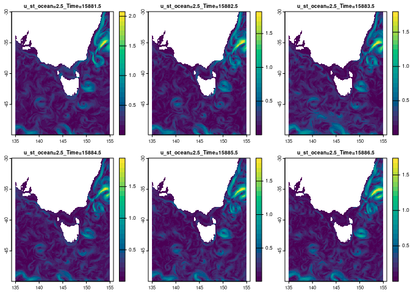
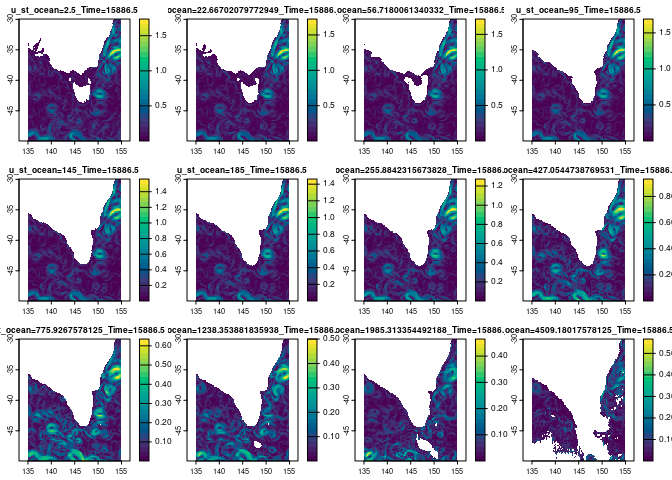

<!-- README.md is generated from README.Rmd. Please edit that file -->

# bluelink

<!-- badges: start -->
<!-- badges: end -->

The goal of bluelink is to provide access to the Bluelink Reanalysis
(BRAN2020) via NetCDF sources.

## Bluelink is

BRAN2020, a 4 dimensional nearly-global ocean product organized by
monthly files at 0.1 degree resolution with 51 depth levels
(‘3600x1500x51x<days>’). The goal of BRAN is to provide a realistic
quantitative description of the three-dimensional time-varying ocean
circulation of all physical variables (temperature, salinity, sea-level
and three components of velocity) for the last few decades.
<https://research.csiro.au/bluelink/global/reanalysis/>

## Installation

You can install the development version of bluelink like so:

``` r
remotes::install_github("mdsumner/bluelink")
```

## Example

This is a basic example which shows you how to solve a common problem:

``` r
library(bluelink)
temp <- readRDS(system.file("extdata/ocean_temp.rds", package = "bluelink", mustWork = TRUE))


files <- tidyr::unnest(temp, cols = "bands") |> dplyr::filter(zlevel == 1)

files 
#> # A tibble: 10,773 × 7
#>    fileurl                    dsn   ncurl date                zlevel     z  band
#>    <chr>                      <chr> <chr> <dttm>               <int> <dbl> <int>
#>  1 https://dapds00.nci.org.a… /vsi… http… 1993-01-01 12:00:00      1   2.5     1
#>  2 https://dapds00.nci.org.a… /vsi… http… 1993-01-02 12:00:00      1   2.5    52
#>  3 https://dapds00.nci.org.a… /vsi… http… 1993-01-03 12:00:00      1   2.5   103
#>  4 https://dapds00.nci.org.a… /vsi… http… 1993-01-04 12:00:00      1   2.5   154
#>  5 https://dapds00.nci.org.a… /vsi… http… 1993-01-05 12:00:00      1   2.5   205
#>  6 https://dapds00.nci.org.a… /vsi… http… 1993-01-06 12:00:00      1   2.5   256
#>  7 https://dapds00.nci.org.a… /vsi… http… 1993-01-07 12:00:00      1   2.5   307
#>  8 https://dapds00.nci.org.a… /vsi… http… 1993-01-08 12:00:00      1   2.5   358
#>  9 https://dapds00.nci.org.a… /vsi… http… 1993-01-09 12:00:00      1   2.5   409
#> 10 https://dapds00.nci.org.a… /vsi… http… 1993-01-10 12:00:00      1   2.5   460
#> # … with 10,763 more rows
```

Now read through your chosen interface.

``` r
library(terra)
#> terra 1.6.7
fs <- files |> dplyr::filter(date >= (max(date) - 5 * 24 * 3600))

## these are all the same file so we don't have to vectorize file to band
r <- rast(fs$dsn, lyrs = fs$band)
ex <- c(135, 155, -50, -30)
plot(crop(r, ext(ex)))
```


The system is pretty templated, so we can sub in a different variable.

``` r
u <- gsub("ocean_temp", "ocean_u", fs$dsn)
v <- gsub("ocean_temp", "ocean_v", fs$dsn)
u1 <- crop(rast(u, lyrs = fs$band), ext(ex))
v1 <- crop(rast(v, lyrs = fs$band), ext(ex))

plot(sqrt(u1^2 + v1^2), col = hcl.colors(26))
```



``` r

## the available vars generally come after "ocean_" but note there are others with a different pattern
branvariables <-
c("atm_flux_diag", "ice_force", "ocean_eta_t", "ocean_force",
"ocean_mld", "ocean_salt", "ocean_temp", "ocean_tx_trans_int_z",
"ocean_ty_trans_int_z", "ocean_u", "ocean_v", "ocean_w")
```

Go for depth.

``` r
zfiles <- tidyr::unnest(temp, cols = "bands") |> dplyr::filter(date == max(date))
idx <- as.integer(seq(1, 51, length.out = 12))
zfiles <- zfiles[idx, ]
## w too
u <- gsub("ocean_temp", "ocean_u", zfiles$dsn)
v <- gsub("ocean_temp", "ocean_v", zfiles$dsn)
#w <- vapour::vapour_vrt(, 
#                        extent = c(0.05, 360.05, -74.95,  75.05))
w <- gsub("ocean_temp", "ocean_w", zfiles$dsn)

u1 <- crop(rast(u, lyrs = zfiles$band), ext(ex))
v1 <- crop(rast(v, lyrs = zfiles$band), ext(ex))
w1 <- rast(w, lyrs = zfiles$band)
## w is offset to uv and temp because Arakawa-b
set.ext(w1, ext(rast(u[1], lyrs = 1)))
#> class       : SpatRaster 
#> dimensions  : 1500, 3600, 12  (nrow, ncol, nlyr)
#> resolution  : 0.1, 0.1  (x, y)
#> extent      : 0.05, 360.05, -74.95, 75.05  (xmin, xmax, ymin, ymax)
#> coord. ref. :  
#> source      : ocean_w_2022_06.nc:w 
#> varname     : w (dia-surface velocity T-points) 
#> names       : w_sw_~886.5, w_sw_~886.5, w_sw_~886.5, w_sw_~886.5, w_sw_~886.5, w_sw_~886.5, ... 
#> unit        :       m/sec,       m/sec,       m/sec,       m/sec,       m/sec,       m/sec, ...
w1 <- crop(w1, ext(ex))

plot(sqrt(u1^2 + v1^2 + w1^2), col = hcl.colors(26))
```



``` r

#u1 <- vapour::vapour_warp_raster(zfiles$dsn[1], extent = ex, dimension = c(500, 500), bands = zfiles$band)
```

## Code of Conduct

Please note that the bluelink project is released with a [Contributor
Code of
Conduct](https://contributor-covenant.org/version/2/1/CODE_OF_CONDUCT.html).
By contributing to this project, you agree to abide by its terms.
