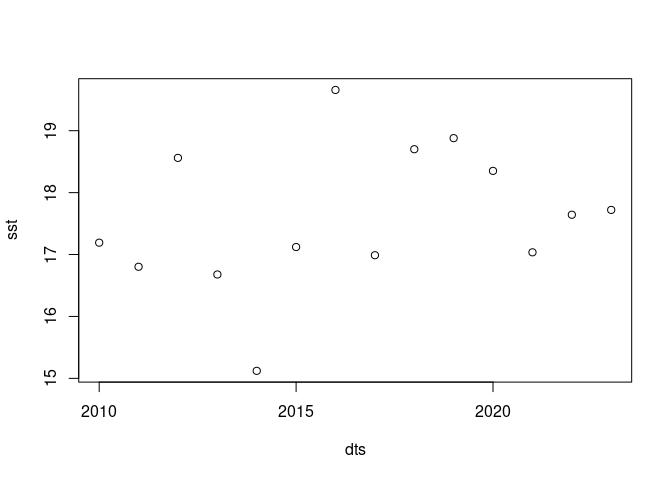

<!-- README.md is generated from README.Rmd. Please edit that file -->

# bluelink

<!-- badges: start -->

[](https://github.com/mdsumner/bluelink/actions/workflows/R-CMD-check.yaml)
<!-- badges: end -->

The goal of bluelink is to provide access to the Bluelink Reanalysis
(BRAN2020) via NetCDF sources.

## Bluelink is

BRAN2020, a 4 dimensional nearly-global ocean product organized by
monthly files at 0.1 degree resolution with 51 depth levels
(‘3600x1500x51x<days>’). The goal of BRAN is to provide a realistic
quantitative description of the three-dimensional time-varying ocean
circulation of all physical variables (temperature, salinity, sea-level
and three components of velocity) for the last few decades.
<https://research.csiro.au/bluelink/global/reanalysis/>

## Installation

You can install the development version of bluelink like so:

``` r
remotes::install_github("mdsumner/bluelink")
```

## Example

This is a basic example which shows you how to read the earliest
available for this variable.

``` r
library(bluelink)
read_bluelink(varname = "ocean_w")
#> class       : SpatRaster 
#> dimensions  : 1500, 3600, 1  (nrow, ncol, nlyr)
#> resolution  : 0.1, 0.1  (x, y)
#> extent      : 0, 360, -75, 75  (xmin, xmax, ymin, ymax)
#> coord. ref. : +proj=longlat +datum=WGS84 +no_defs 
#> source      : ocean_w_2010_01.nc:w 
#> varname     : w (dia-surface velocity T-points) 
#> name        : w_Time=11323.5_sw_ocean=5 
#> unit        :                     m/sec 
#> time        : 2010-01-01 12:00:00 UTC
```

Other variables sometimes have diferent ranges in times.

``` r
read_bluelink(varname = "ocean_temp")
#> class       : SpatRaster 
#> dimensions  : 1500, 3600, 1  (nrow, ncol, nlyr)
#> resolution  : 0.1, 0.1  (x, y)
#> extent      : 0, 360, -75, 75  (xmin, xmax, ymin, ymax)
#> coord. ref. : +proj=longlat +datum=WGS84 +no_defs 
#> source      : ocean_temp_2010_01.nc:temp 
#> varname     : temp (Potential temperature) 
#> name        : temp_Time=11323.5_st_ocean=2.5 
#> unit        :                      degrees C 
#> time        : 2010-01-01 12:00:00 UTC
```

We can give a particular date.

``` r
read_bluelink("2023-12-31", varname = "ocean_temp")
#> class       : SpatRaster 
#> dimensions  : 1500, 3600, 1  (nrow, ncol, nlyr)
#> resolution  : 0.1, 0.1  (x, y)
#> extent      : 0, 360, -75, 75  (xmin, xmax, ymin, ymax)
#> coord. ref. : +proj=longlat +datum=WGS84 +no_defs 
#> source      : ocean_temp_2023_12.nc:temp 
#> varname     : temp (Potential temperature) 
#> name        : temp_Time=16435.5_st_ocean=2.5 
#> unit        :                      degrees C 
#> time        : 2023-12-31 12:00:00 UTC
```

Generally, take the year you are in and you should be able to get days
from last year.

## Try a time series

Every day on the first of September

``` r
dts <- seq(as.Date("2010-01-01"), as.Date("2023-10-10"), by = "1 year")

options(parallelly.fork.enable = TRUE, future.rng.onMisuse = "ignore")
library(furrr); plan(multicore)
#> Loading required package: future
#> Warning in getCGroupsRoot(controller = controller): Mixed CGroups versions are
#> not supported: 'cgroup2', 'cgroup'

sst <- future_map_dbl(dts, \(.x) terra::extract(read_bluelink(.x, varname = "ocean_temp"), cbind(150, -42))[[1]])
plan(sequential)
plot(dts, sst)
```



## Code of Conduct

Please note that the bluelink project is released with a [Contributor
Code of
Conduct](https://contributor-covenant.org/version/2/1/CODE_OF_CONDUCT.html).
By contributing to this project, you agree to abide by its terms.
