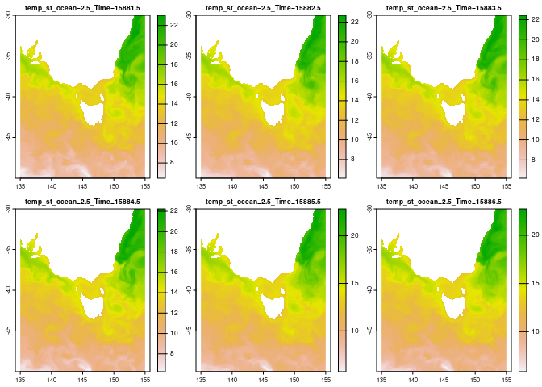

<!-- README.md is generated from README.Rmd. Please edit that file -->

# bluelink

<!-- badges: start -->
<!-- badges: end -->

The goal of bluelink is to provide access to the Bluelink Reanalysis
(BRAN2020) via NetCDF sources.

## Bluelink is

BRAN2020, a 4 dimensional nearly-global ocean product organized by
monthly files at 0.1 degree resolution with 51 depth levels
(‘3600x1500x51x<days>’). The goal of BRAN is to provide a realistic
quantitative description of the three-dimensional time-varying ocean
circulation of all physical variables (temperature, salinity, sea-level
and three components of velocity) for the last few decades.
<https://research.csiro.au/bluelink/global/reanalysis/>

## Installation

You can install the development version of bluelink like so:

``` r
remotes::install_github("mdsumner/bluelink")
```

## Example

This is a basic example which shows you how to solve a common problem:

``` r
library(bluelink)
temp <- readRDS(system.file("extdata/ocean_temp.rds", package = "bluelink", mustWork = TRUE))


files <- tidyr::unnest(temp, cols = "bands") |> dplyr::filter(zlevel == 1)

files 
#> # A tibble: 10,773 × 7
#>    fileurl                    dsn   ncurl date                zlevel     z  band
#>    <chr>                      <chr> <chr> <dttm>               <int> <dbl> <int>
#>  1 https://dapds00.nci.org.a… /vsi… http… 1993-01-01 12:00:00      1   2.5     1
#>  2 https://dapds00.nci.org.a… /vsi… http… 1993-01-02 12:00:00      1   2.5    52
#>  3 https://dapds00.nci.org.a… /vsi… http… 1993-01-03 12:00:00      1   2.5   103
#>  4 https://dapds00.nci.org.a… /vsi… http… 1993-01-04 12:00:00      1   2.5   154
#>  5 https://dapds00.nci.org.a… /vsi… http… 1993-01-05 12:00:00      1   2.5   205
#>  6 https://dapds00.nci.org.a… /vsi… http… 1993-01-06 12:00:00      1   2.5   256
#>  7 https://dapds00.nci.org.a… /vsi… http… 1993-01-07 12:00:00      1   2.5   307
#>  8 https://dapds00.nci.org.a… /vsi… http… 1993-01-08 12:00:00      1   2.5   358
#>  9 https://dapds00.nci.org.a… /vsi… http… 1993-01-09 12:00:00      1   2.5   409
#> 10 https://dapds00.nci.org.a… /vsi… http… 1993-01-10 12:00:00      1   2.5   460
#> # … with 10,763 more rows
```

Now read through your chosen interface.

``` r
library(terra)
#> terra 1.6.7
fs <- files |> dplyr::filter(date >= (max(date) - 5 * 24 * 3600))

## these are all the same file so we don't have to vectorize file to band
r <- rast(fs$dsn, lyrs = fs$band)
plot(crop(r, ext(135, 155, -50, -30)))
```

 \## Code of
Conduct

Please note that the bluelink project is released with a [Contributor
Code of
Conduct](https://contributor-covenant.org/version/2/1/CODE_OF_CONDUCT.html).
By contributing to this project, you agree to abide by its terms.
